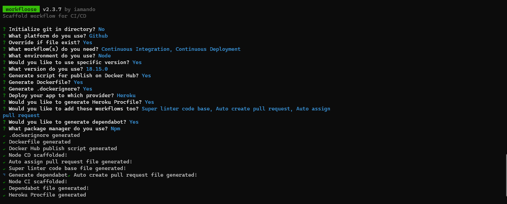

# Workfloose


Scaffold workflow for CI/CD



## Install

```bash
# recommended
npx workfloose

# using npm global installation
npm install -g workfloose

# using yarn global installation
yarn add global workfloose
```

## Command-line Interface (CLI)

Change to your working repository

```bash
cd project_name
```

Now, you can generate workflows with the command **genarate**

```bash
# recommended
npx workfloose generate

# using global installation
workfloose generate
```

The following is the help text from the workfloose cli. To see this and more information anytime,add the **help** command to your call.

```bash
# recommended
npx workfloose help

# using global installation
workfloose help
```

Check version of workfloose with **version** command

```bash
# recommended
npx workfloose version

# using global installation
workfloose version
```

## Support

Workfloose is an MIT-licensed open source project. It can grow thanks to the sponsors and support.

## License

Workfloose is [MIT licensed](LICENSE).
